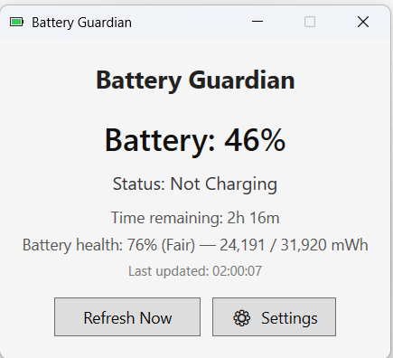
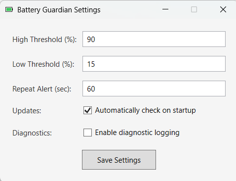
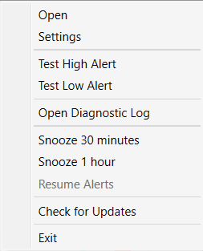
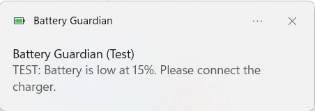

# Battery Guardian
[](https://github.com/puneet-swarup/Battery-Guardian/actions/workflows/build.yml)
[](https://github.com/puneet-swarup/Battery-Guardian/releases/latest)
[](https://github.com/puneet-swarup/Battery-Guardian/blob/main/LICENSE)
[](https://www.microsoft.com/windows)
[](https://dotnet.microsoft.com/)
[](https://github.com/puneet-swarup/Battery-Guardian/releases)
[](https://github.com/puneet-swarup/Battery-Guardian/stargazers)
[](https://github.com/puneet-swarup/Battery-Guardian/issues)
[](https://github.com/puneet-swarup/Battery-Guardian/commits/main)
[](https://github.com/puneet-swarup/Battery-Guardian)

A lightweight, open-source WPF application for Windows that helps extend your laptop battery lifespan by notifying you when it's time to unplug or plug in your charger.

Lithium-ion batteries degrade fastest when kept at 100% charge for extended periods, or when drained below 15%. Battery Guardian sits quietly in your system tray and alerts you via voice, beep, and toast notifications so you never forget to manage your battery health.

---

## 📸 Screenshots

<p align="center">
  
  &nbsp;&nbsp;
  
  &nbsp;&nbsp;
  
  &nbsp;&nbsp;
  
</p>

---

## ✨ Features

- **Real-time Monitoring**: Displays current battery percentage and charging status.
- **Estimated Time**: Shows time remaining while discharging, and time to full while charging (when the OS reports it).
  > Estimated Time: Shows time remaining (hybrid native + WMI fallback) while discharging, and time to full while charging (when the OS reports it). Some laptops may still show "Calculating..." if neither method provides a value.
- **Automatic Refresh**: Updates the status every 30 seconds.
- **Manual Refresh**: Click the "Refresh Now" button for instant updates.
- **Smart Alerts**:
  - **High Charge Alert**: When the charger is **plugged in** and battery reaches the High threshold (default 95%), it plays a beep, shows a notification, and speaks *"Battery is at X%. Consider unplugging the charger."*
  - **Low Charge Alert**: When the charger is **not plugged in** and battery drops to the Low threshold (default 15%), it plays a beep, shows a notification, and speaks *"Battery is low at X%. Please connect the charger."*
- **Repeat Reminders**: If you ignore an alert, the voice message and beep will **repeat automatically** after a configurable interval (default: 5 minutes) until you act.
- **Auto-Stop**: The alert stops **immediately** when you plug in/unplug the charger, even if the battery percentage hasn't crossed the threshold yet.
- **Voice Notifications**: Uses Windows built-in Text-to-Speech for clear audio alerts.
- **Native Windows Toasts**: Alerts appear as real Windows 10/11 Action Center notifications (the same style as Outlook/Teams). They persist in the Action Center so you don't miss them.
- **System Tray Icon**: Uses the battery-themed application icon; tooltip shows current percentage and charging status.- **Fully Configurable**: Customize the High threshold, Low threshold, and Repeat interval via the Settings window.
- **Auto-Start**: Registers itself to launch automatically when you sign into Windows (on first run).
- **Battery Health**: Displays the current full-charge capacity vs. original design capacity (wear level), when the laptop reports it.
- **Native app icon** — battery-themed icon across the window, taskbar, and .exe.
- **Automatic Update Check**: Notifies you when a newer version is available and offers a one-click link to the download page.
- **Snooze**: Temporarily silence alerts for 30 minutes or 1 hour. Useful during meetings or presentations. Alerts resume automatically when the snooze expires.
- **Diagnostic logging**: Optional toggle in Settings for troubleshooting.
---

## 🛠️ Prerequisites

- **Windows 10 version 1809 (build 17763) or later** (64-bit)..
- **Visual Studio 2022** (with the `.NET Desktop Development` workload installed).
- **.NET 10 SDK** (included with VS 2022 17.10+).

---

## 📦 Download Options

| Variant | Size | Requires |
|---|---|---|
| **Self-Contained** (recommended for most) | ~200 MB | Nothing — the .NET runtime is bundled |
| **Framework-Dependent** (for advanced users) | ~10 MB | [.NET 10 Desktop Runtime](https://dotnet.microsoft.com/download/dotnet/10.0) must be installed |

Both variants contain the same app and the same installer scripts. Pick the small one if you already have .NET 10 installed; pick the big one if you want zero setup.

---

## 🚀 Installation

1. Download the latest `BatteryGuardian-x64-Release.zip` from the [Releases page](https://github.com/puneet-swarup/Battery-Guardian/releases/latest).
2. Extract the ZIP to any folder.
3. Double-click **`install.bat`**.
4. The app installs to `%LocalAppData%\Programs\BatteryGuardian\` and appears in your Start Menu and Settings → Apps.

**To uninstall:** Open **Settings → Apps → Installed apps**, search for **Battery Guardian**, and click **Uninstall**. Or run `uninstall.bat` from the install folder.

No admin rights required. No system-wide changes — all files stay under your user profile.

### Build from Source

If you'd rather build from source:

1. Clone the repo:
   ```cmd
   git clone https://github.com/puneet-swarup/Battery-Guardian.git
   ```
2. Open BatteryGuardian.sln in Visual Studio 2022.

3. Restore NuGet packages, then press F5.

--- 
## 📖 How to Use
**First Launch**: When you run the app, it will immediately minimize to the System Tray (bottom-right corner of your taskbar). You will see a battery icon.

**Open the UI**: Double-click the battery icon in the system tray to open the main window. You can also right-click it and choose "Open".

**Change Settings**: Right-click the system tray icon and select Settings. Here you can adjust:

  - High Threshold (default: 95%)

  - Low Threshold (default: 15%)

  - Repeat Alert Every (seconds) (default: 300)

**Auto-Start with Windows**: The first time you run the app, it will automatically add a registry entry to launch itself every time you log into Windows. To remove it from auto-start, simply open Task Manager > Startup tab, disable "BatteryGuardian", or delete the entry from *HKEY_CURRENT_USER\SOFTWARE\Microsoft\Windows\CurrentVersion\Run*.

---

## ⚙️ Configuration
All settings are saved locally to:

*%LocalAppData%\BatteryGuardian\Settings.json*

You can safely edit this file with a text editor if you prefer, but it is simpler to use the built-in Settings window.

---

## 🗺️ Roadmap
- Native Windows toast notifications with action buttons (Snooze / Dismiss).

- Battery health (wear level) reporting.

- WiX-based MSI installer with a proper uninstaller.

- Auto-update from GitHub Releases.

- Unit tests for the alert-evaluation logic.

See *CHANGELOG.md* for a full history of changes.

---

## 🧪 Running Tests

The project includes unit tests for the alert-evaluation logic. To run them:

```cmd
dotnet test
```

Or from Visual Studio: Test → Run All Tests (Ctrl + R, A).

All tests must pass before submitting a pull request.

---

## 🤝 Contributing
Contributions are welcome! Please open an issue first to discuss what you'd like to change, and check the Pull Request template when submitting code.

---

## 🛡️ Disclaimer
This application uses the standard Windows APIs (GetSystemPowerStatus) to read battery data. It does not have the ability to physically stop your laptop from charging (that is a hardware-level limitation). It is designed solely as an alert assistant to remind you to manually unplug your charger when the battery is full.

## 🔐 Code Signing

Free code signing provided by [SignPath.io](https://signpath.io/), certificate by [SignPath Foundation](https://signpath.org/). See [Code Signing Policy](CODE_SIGNING_POLICY.md).