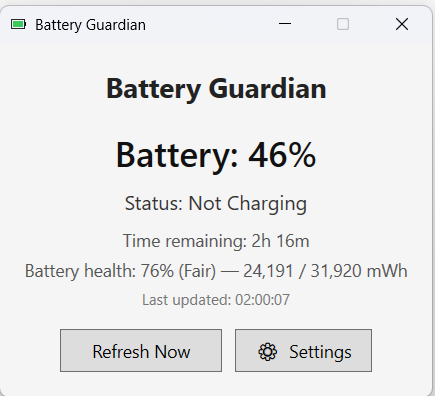
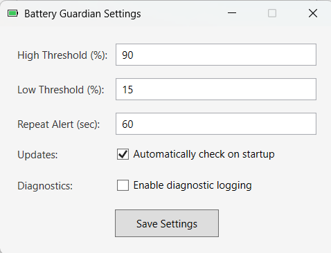
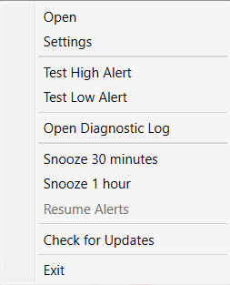
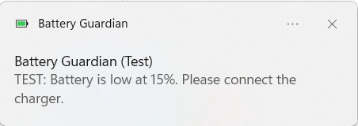

# Battery Guardian
[](https://github.com/puneet-swarup/Battery-Guardian/actions/workflows/build.yml)
[](https://github.com/puneet-swarup/Battery-Guardian/actions/workflows/android.yml)
[](https://github.com/puneet-swarup/Battery-Guardian/releases/latest)
[](https://github.com/puneet-swarup/Battery-Guardian/blob/main/LICENSE)
[](https://www.microsoft.com/windows)
[](https://developer.android.com/)
[](https://dotnet.microsoft.com/)
[](https://kotlinlang.org/)
[](https://gradle.org/)
[](https://github.com/puneet-swarup/Battery-Guardian/releases)
[](https://github.com/puneet-swarup/Battery-Guardian/stargazers)
[](https://github.com/puneet-swarup/Battery-Guardian/issues)
[](https://github.com/puneet-swarup/Battery-Guardian/commits/main)
[](https://github.com/puneet-swarup/Battery-Guardian)

A lightweight, open-source battery-health assistant that helps extend your battery lifespan by notifying you when it's time to unplug or plug in your charger. Available for **Windows** (WPF, .NET 10) and **Android** (Kotlin).

Lithium-ion batteries degrade fastest when kept at 100% charge for extended periods, or when drained below 15%. Battery Guardian runs quietly in the background and alerts you via voice, beep, and notifications so you never forget to manage your battery health.

---

## 📱 Platforms

This repository ships **two** native apps that share the same alert logic and default thresholds:

| Platform | Stack | Min version | Docs |
|---|---|---|---|
| 🪟 **Windows** | WPF, .NET 10 | Windows 10 (1809)+ | [Windows section](#-windows-app) |
| 🤖 **Android** | Kotlin, Material Components | Android 9 (Pie) | [Android/README.md](Android/README.md) |

Both are built and tested automatically on every push and pull request by GitHub Actions:

| Workflow | Target | Status |
|---|---|---|
| `build.yml` | Windows EXE (.NET 10) | [](https://github.com/puneet-swarup/Battery-Guardian/actions/workflows/build.yml) |
| `android.yml` | Android APK (Kotlin) | [](https://github.com/puneet-swarup/Battery-Guardian/actions/workflows/android.yml) |

---

## 🪟 Windows App

### 📸 Screenshots

<p align="center">
  
  &nbsp;&nbsp;
  
  &nbsp;&nbsp;
  
  &nbsp;&nbsp;
  
</p>

---

## ✨ Features

- **Real-time Monitoring**: Displays current battery percentage and charging status.
- **Estimated Time**: Shows time remaining while discharging, and time to full while charging (when the OS reports it).
  > Estimated Time: Shows time remaining (hybrid native + WMI fallback) while discharging, and time to full while charging (when the OS reports it). Some laptops may still show "Calculating..." if neither method provides a value.
- **Automatic Refresh**: Updates the status every 30 seconds.
- **Manual Refresh**: Click the "Refresh Now" button for instant updates.
- **Smart Alerts**:
  - **High Charge Alert**: When the charger is **plugged in** and battery reaches the High threshold (default 95%), it plays a beep, shows a notification, and speaks *"Battery is at X%. Consider unplugging the charger."*
  - **Low Charge Alert**: When the charger is **not plugged in** and battery drops to the Low threshold (default 15%), it plays a beep, shows a notification, and speaks *"Battery is low at X%. Please connect the charger."*
- **Repeat Reminders**: If you ignore an alert, the voice message and beep will **repeat automatically** after a configurable interval (default: 5 minutes) until you act.
- **Auto-Stop**: The alert stops **immediately** when you plug in/unplug the charger, even if the battery percentage hasn't crossed the threshold yet.
- **Voice Notifications**: Uses Windows built-in Text-to-Speech for clear audio alerts.
- **Native Windows Toasts**: Alerts appear as real Windows 10/11 Action Center notifications (the same style as Outlook/Teams). They persist in the Action Center so you don't miss them.
- **System Tray Icon**: Uses the battery-themed application icon; tooltip shows current percentage and charging status.- **Fully Configurable**: Customize the High threshold, Low threshold, and Repeat interval via the Settings window.
- **Auto-Start**: Registers itself to launch automatically when you sign into Windows (on first run).
- **Battery Health**: Displays the current full-charge capacity vs. original design capacity (wear level), when the laptop reports it.
- **Native app icon** — battery-themed icon across the window, taskbar, and .exe.
- **Automatic Update Check**: Notifies you when a newer version is available and offers a one-click link to the download page.
- **Snooze**: Temporarily silence alerts for 30 minutes or 1 hour. Useful during meetings or presentations. Alerts resume automatically when the snooze expires.
- **Diagnostic logging**: Optional toggle in Settings for troubleshooting.
---

## 🛠️ Prerequisites

- **Windows 10 version 1809 (build 17763) or later** (64-bit)..
- **Visual Studio 2022** (with the `.NET Desktop Development` workload installed).
- **.NET 10 SDK** (included with VS 2022 17.10+).

---

## 📦 Download Options

| Variant | Size | Requires |
|---|---|---|
| **Self-Contained** (recommended for most) | ~200 MB | Nothing — the .NET runtime is bundled |
| **Framework-Dependent** (for advanced users) | ~10 MB | [.NET 10 Desktop Runtime](https://dotnet.microsoft.com/download/dotnet/10.0) must be installed |

Both variants contain the same app and the same installer scripts. Pick the small one if you already have .NET 10 installed; pick the big one if you want zero setup.

---

## 🚀 Installation

1. Download the latest `BatteryGuardian-x64-Release.zip` from the [Releases page](https://github.com/puneet-swarup/Battery-Guardian/releases/latest).
2. Extract the ZIP to any folder.
3. Double-click **`install.bat`**.
4. The app installs to `%LocalAppData%\Programs\BatteryGuardian\` and appears in your Start Menu and Settings → Apps.

**To uninstall:** Open **Settings → Apps → Installed apps**, search for **Battery Guardian**, and click **Uninstall**. Or run `uninstall.bat` from the install folder.

No admin rights required. No system-wide changes — all files stay under your user profile.

### Build from Source

If you'd rather build from source:

1. Clone the repo:
   ```cmd
   git clone https://github.com/puneet-swarup/Battery-Guardian.git
   ```
2. Open BatteryGuardian.sln in Visual Studio 2022.

3. Restore NuGet packages, then press F5.

--- 
## 📖 How to Use
**First Launch**: When you run the app, it will immediately minimize to the System Tray (bottom-right corner of your taskbar). You will see a battery icon.

**Open the UI**: Double-click the battery icon in the system tray to open the main window. You can also right-click it and choose "Open".

**Change Settings**: Right-click the system tray icon and select Settings. Here you can adjust:

  - High Threshold (default: 95%)

  - Low Threshold (default: 15%)

  - Repeat Alert Every (seconds) (default: 300)

**Auto-Start with Windows**: The first time you run the app, it will automatically add a registry entry to launch itself every time you log into Windows. To remove it from auto-start, simply open Task Manager > Startup tab, disable "BatteryGuardian", or delete the entry from *HKEY_CURRENT_USER\SOFTWARE\Microsoft\Windows\CurrentVersion\Run*.

---

## ⚙️ Configuration
All settings are saved locally to:

*%LocalAppData%\BatteryGuardian\Settings.json*

You can safely edit this file with a text editor if you prefer, but it is simpler to use the built-in Settings window.

---

## 🤖 Android App

A native Kotlin port of Battery Guardian for Android 9 (Pie) and newer. It runs a foreground service that watches the battery and alerts you — notification, sound, speech (TTS) and vibration — when you should unplug at high charge or plug in at low charge.

| Property | Value |
|---|---|
| Package | `com.puneet.batteryguardian` |
| Language | Kotlin |
| Min SDK | 28 (Android 9 Pie) |
| Target / Compile SDK | 36 |
| Build system | Gradle 9.4.1 + Android Gradle Plugin 9.2.0 |

📖 **Full build, signing and testing instructions: [Android/README.md](Android/README.md)**

### Quick start

From the `Android` folder: `build.bat debug` builds the debug APK, `build.bat install` builds and installs on a connected device. Or use Gradle directly: `gradlew assembleDebug`, `gradlew installDebug`, `gradlew testDebugUnitTest`.

The debug APK is written to `Android/app/build/outputs/apk/debug/app-debug.apk`.

### Android feature parity

- **High / Low charge alerts** using the same default thresholds as Windows (95% / 15%).
- **Repeat reminders** at a configurable interval (default 5 minutes).
- **Snooze** alerts (30 min / 1 hour / 2 hours).
- **Notification + beep + text-to-speech + vibration** alert channels.
- **Foreground service** so monitoring survives Android's background limits (the ongoing notification replaces the Windows tray icon).
- **Battery health** (wear level) where the device exposes design capacity.
- **Battery-optimisation exemption** button for reliable background monitoring.
- **In-app update check** against GitHub Releases.
- **Diagnostic logging** toggle.

### Android testing

The Android app has **172 JVM unit tests across 19 classes** (plain JUnit + Robolectric) — no device or emulator required, so they run in CI. Coverage is generated with JaCoCo via `build.bat coverage`.

See the [Android testing overview](Android/README.md#testing-overview) for the full class-by-class breakdown.

---

## 🗺️ Roadmap
- WiX-based MSI installer with a proper uninstaller (Windows).
- Play Store listing for the Android app.
- Home-screen widget showing live battery level (Android).

See *CHANGELOG.md* for a full history of changes.

---

## 🧪 Running Tests

Both apps ship with unit tests that run without a device.

**Windows (.NET):**

```cmd
dotnet test
```

Or from Visual Studio: Test → Run All Tests (Ctrl + R, A).

**Android (Kotlin):** run `cd Android` then `build.bat test` (172 JVM unit tests) or `build.bat coverage` (tests + JaCoCo coverage report). No device or emulator needed.

All tests must pass before submitting a pull request.

---

## 🤝 Contributing
Contributions are welcome! Please open an issue first to discuss what you'd like to change, and check the Pull Request template when submitting code.

---

## 🛡️ Disclaimer
These applications read battery data using standard platform APIs (Windows `GetSystemPowerStatus`; Android `BatteryManager` + sysfs). Neither app can physically stop your device from charging (that is a hardware-level limitation). They are designed solely as alert assistants to remind you to manually unplug your charger when the battery is full.

## 🔐 Code Signing

Free code signing provided by [SignPath.io](https://signpath.io/), certificate by [SignPath Foundation](https://signpath.org/). See [Code Signing Policy](CODE_SIGNING_POLICY.md).